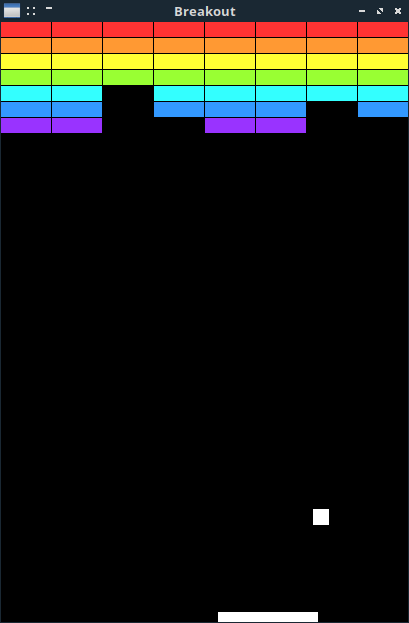

# Breakout

D language port of [Breakout](https://github.com/localhots/breakout) game clone.


### Screenshot




## Requirements

Compile-time dependencies:

- D language compiler (tested  with DMD64 D Compiler v2.083.0)
- DUB


## Compilation

Navigate to a project directory and execute:
```
dmd build
```

## Usage

```
./breakout
```

